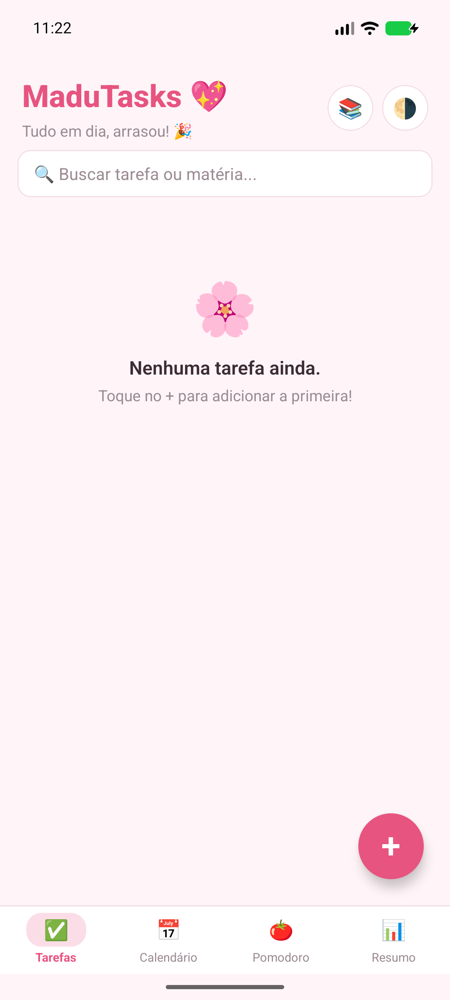
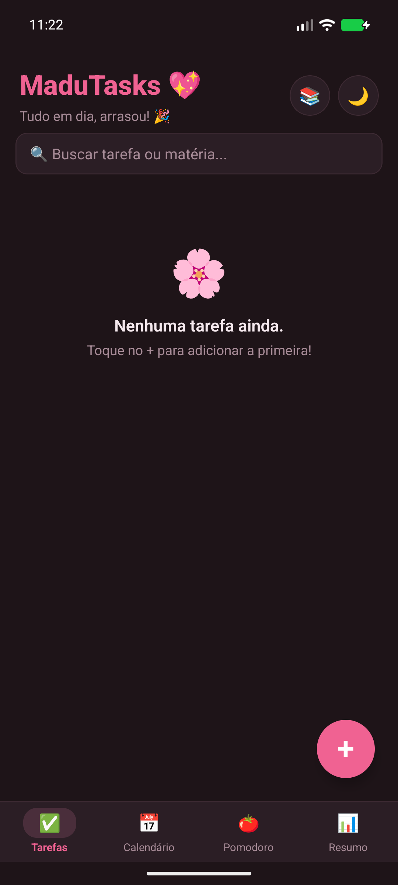
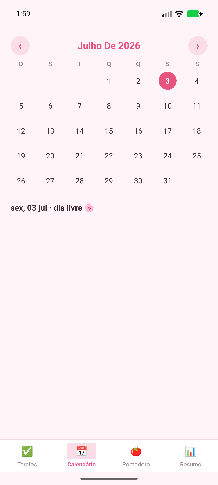
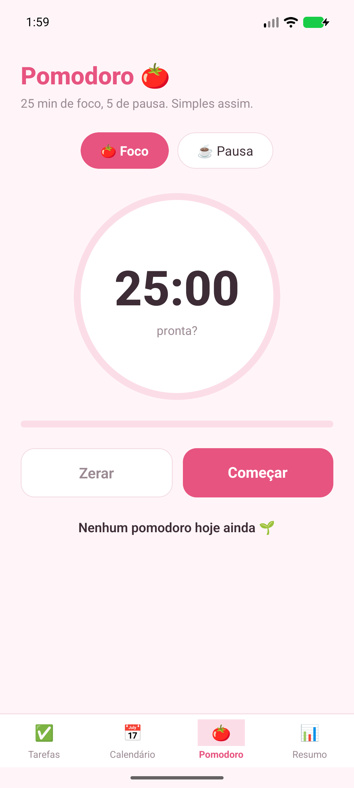
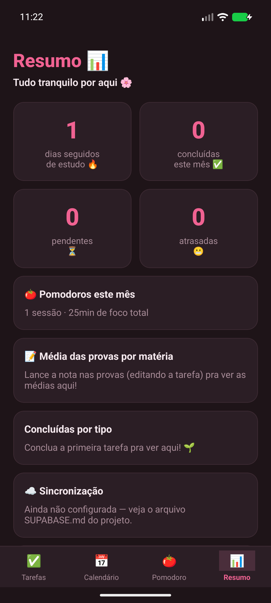
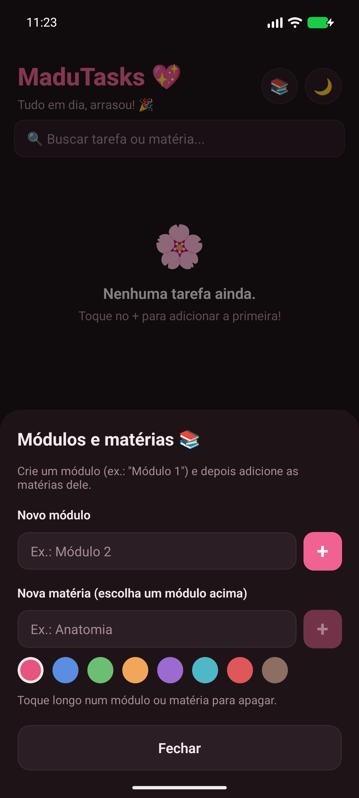

<div align="center">


# MaduTasks

**A agenda de estudos que nasceu de uma promessa.**


</div>

---

## A história

Minha namorada, a **Madu**, faz um curso cheio de provas, trabalhos e entregas — e organizava tudo no **Bloco de Notas** do celular. Eu tinha prometido a ela um app de verdade pra isso.

O **MaduTasks** é essa promessa cumprida: um lugar bonito e simples pra ela anotar as provas e atividades, receber lembretes na hora certa e ter controle dos estudos sem depender de anotação solta. Feito com carinho, do zero, sob medida pra rotina dela.

---

## Funcionalidades

**Organização**
- Tarefas com tipo (prova, trabalho, tarefa), prazo e lembrete configurável (na hora, 1h, 1 dia ou 3 dias antes)
- **Módulos → Matérias** com cores próprias, além de **filtro** e **busca**
- **Etapas** (checklist) dentro de cada tarefa, com progresso no card
- **Repetição semanal**: ao concluir, a próxima ocorrência nasce sozinha
- Edição completa e conclusão com um toque

**Estudo**
- **Calendário** mensal com marcadores coloridos por matéria
- **Pomodoro** com foco e pausa ajustáveis e notificação ao fim do ciclo
- **Notas das provas** com média por matéria
- **Resumo**: concluídas no mês, pendentes, atrasadas e **sequência de dias** estudando
- Confete ao concluir uma tarefa

**Experiência**
- Lembretes locais que funcionam com o app fechado
- **Tema claro e escuro** (automático ou manual)
- **Backup** local (exportar/importar) e **sincronização** entre celular e tablet
- **100% offline** — a internet só é usada (opcionalmente) para sincronizar

---

## Telas

<div align="center">

| Tarefas | Tema escuro | Calendário |
|:---:|:---:|:---:|
|  |  |  |
| **Pomodoro** | **Resumo** | **Matérias** |
|  |  |  |

</div>

---

## Tecnologias

- **React Native 0.86** + **Expo SDK 57** (um código só para celular e tablet)
- **expo-sqlite** — banco local, o app funciona sem internet
- **expo-notifications** — lembretes locais agendados
- **Supabase** (Postgres + Auth) — sincronização opcional na nuvem
- **JavaScript** puro, sem framework de UI externo (componentes próprios)

---

## Arquitetura

Offline-first: o **SQLite é a fonte da verdade** no aparelho; o Supabase é só uma cópia na nuvem para manter celular e tablet iguais (a alteração mais recente vence).

```
madu-tasks/
├── App.js                     # entrada: tema, abas e sincronização inicial
├── src/
│   ├── theme.js               # paletas (clara/escura), tipos e cores de matéria
│   ├── theme-context.js       # provedor de tema com alternância salva
│   ├── db/database.js         # SQLite + migrações + estatísticas + backup
│   ├── notifications/         # lembretes locais (expo-notifications)
│   ├── sync/                  # cliente Supabase + motor de sincronização
│   ├── utils/                 # datas em pt-BR e backup em arquivo
│   ├── components/            # cards, formulário, abas, gerenciador de matérias
│   └── screens/               # Tarefas, Calendário, Pomodoro e Resumo
├── supabase/schema.sql        # tabelas + segurança (RLS) da nuvem
└── SUPABASE.md                # guia de configuração da sincronização
```

---

## Rodando o projeto

**Desenvolvimento** (com o app Expo Go no celular):

```bash
npm install
npx expo start
```

**Gerar o APK** (build local com Android SDK):

```bash
npx expo prebuild --platform android --clean
cd android && ./gradlew assembleRelease
# APK em: android/app/build/outputs/apk/release/app-release.apk
```

Depois é só mandar o `.apk` para o celular, tocar nele e permitir a instalação.

> Os lembretes **não** funcionam dentro do Expo Go (limitação do Android desde o SDK 53), mas funcionam normalmente no APK instalado.

---

## Sincronização entre aparelhos

Opcional e desligada por padrão. Para ligar (celular + tablet com os mesmos dados), siga o passo a passo em **[SUPABASE.md](SUPABASE.md)** — leva uns 10 minutos e usa o plano gratuito do Supabase.

---

## Próximos passos

- Repetição mensal e por intervalo ("a cada 15 dias")
- Anexos e fotos nas tarefas
- Widget na tela inicial do Android

---

<div align="center">

Feito com carinho para a **Madu**.

</div>
